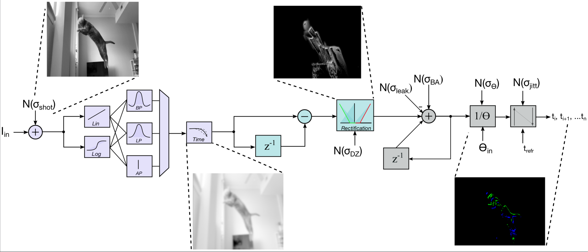
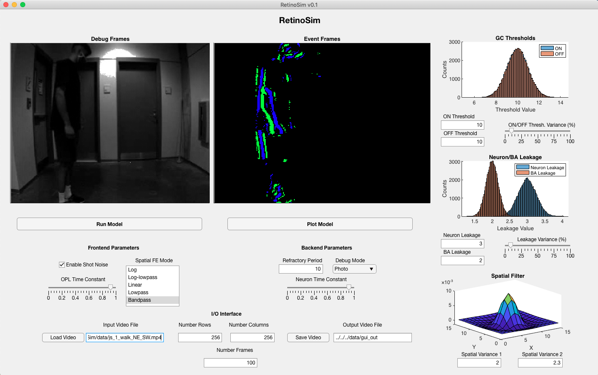

# RetinoSim: an Event-based Data Synthesis Tool for Neuromorphic Vision Architecture Exploration

## Directory Hierarchy

**src/matlab/modeling**: contains the source code for RetinoSim in RetinoSim.m, other functions are sub-routines called from this top file or used for characterization

**src/matlab/dbg_scripts**: contains a debug script template to save parameters and experiment with function parameterization

**src/matlab/demo**: contains a script to load input video, load saved parameters, run model, display video, and optionally save video to local disk.

**src/matlab/app**: contains RetinoSim GUI that can be launched in the command window.

**src/data**: includes example video files that can be used for demonstration and GUI experimentation.

## Software Notes

All code is compatible with Matlab 2017-2021.1a. The model has also been verified on a Intel-based Macbook running Mojave (10.14.6) and AMD Ryzen-based PC running CentOS 7.7.1908.

## GUI Run Guide

A screen shot of the RetinoSim v0.1 GUI can be seen above. Using the GUI can be succintly broken down into four steps. 

1. Importing a video to be used for event conversion.
2. Configuring the model.
3. Running the model and plotting results. 
4. Saving model outputs to a local directory.

### File Importing

The **I/O interface** panel contains all the configuration needed to import a local video. First, the use should stipulate the height, width, and frames desired from their input video. If the number of frames is larger than that present in the input stream, the entire video is simply used. 

Next, the user should **Load Video** which will open a File Navigator window where they can select a valid .mp4 or .avi file. Other file types have not been verified. 

After the file has been selected, the re-sized and trimmed video will play in the Debug Frames subwindow.

### Model Configuration

Next, the user can use the frontend, backend, and graphical display subwindows to configure the model parameters. Refer to the RetinoSim Parameters section of this README to learn more about each parameter. Upon configuring the frontend or backend parameters, the GUI will return the parameters structure contents to the command window which allows the user to verify slider values, etc.

### Running and Plotting the Model

Press the **Run Model** button to start the video-to-event conversion. During run time, the model will return the current processing frame to the MATLAB command window. Upon completion, RetinoSim will also return run statistics such as input video dimensions, number of output events, events-per-second, and frames-per-second throughputs. In the GUI, the **Run Model** button will turn dark gray when the model is running but will revert to it's lighter shade upon completion. 

**Plot Model** button is used to visualize RetinoSim results. The **Event Frames** subwindow displays the binned output events generated from the model. **Debug Frames** subwindow displays the layer output specified using the **Debug Mode** dropdown in the backend parameters panel.

### Saving Model Outputs

Pressing the **Save Video** button will upon up another File Navigator window. Here, the user should specify what directory to save model outputs to AND what the file prefix of each should be. After this has been completed, the GUI will save the event frames video, a blended video that contains the input stream with the event frames overlaid, and the output events in a *.mat* format.

## Scripts Run Guide 

### Demo Script 

Location: `src/matlab/demo/demo_RetinoSim.m`

Script that loads pre-configured parameters from the **dbg_scripts** directory, imports the room pan video from the **data** directory, runs the model, and optionally saves the outputs. This demonstrates the basic flow that the user can further configure to utilize the model using pre-configured parameters. Simply press  **Run** in the script window or type `demo_RetinoSim` in the MATLAB command window.

### Basic Debug

Location: `src/matlab/dbg_scripts/test_RetinoSim_basic.m`

A more-involved script that allows further user configuration of model parameters. Here similar tasks can be accomplished as in the demo script, but now the user has the option to load, customize, and save new model parameters. The set of parameters in this directory were generated for each spatial frontend and serve as a basis for future customization. 

By setting, 

    customize_params = true;
    save_params = false;
    write_video  = false;
the user will be able to trial parameters without saving internally. By setting `save_params = true;`, parameters will be saved to the name specified in variable `params_file_name`. Writing a video is configured similarly. By setting `customize_params = false;`, parameters will be loaded from the file specified by variable `params_file_name`.

### Dataset Matching

Location: `src/matlab/dbg_scripts/test_RetinoSim_w_dataset.m`

This script shows how to import frames and events from an existing dataset and display a matched RetinoSim output. The  *shapes_6dof* sample from the Event Camera dataset from RPG @ ETH is used to demonstrate RetinoSim capabilities. The user just needs to download the dataset locally and change the input paths appropriately. 

## RetinoSim Parameters 

### General Parameters

`params.time_step` (*double, nom. = 10*): timestamp resolution (in ms) of model, this can be modified by the used to match the inverse of the input video FPS. Note: output timestamps are multiplied by 1000 to convert to units of microseconds which matches the format of AER data.

`params.dbg_mode` (*string, nom. = 'photo'*): configures which layer output will be saved to output video stream `dbg_frames`. Model needs to be re-run to save another layer to `dbg_frames`.

`params.debug_pixel` (*1x2 int. vector, nom. = (127,127)*): specifies the specific pixel temporal response save to output structure `pixDbg`. This structure has members that contain the pixel response of each model layer to allow for fine-grained debugging. 

### Frontend (OPL) Parameters

`params.enable_shot_noise` (*boolean, nom. = False*): enables the injection of photoreceptor shotnoise into the model. This is inversely proportional to the pixel intensity to model the mechanisms effect on signal quality.

`params.spatial_fe_mode` (*string, nom. = 'log'*): specifies the OPL spatial filter and compression mode. There are four options - *log,log-lowpass,linear,lowpass,bandpass*. Log FE modes use log compression on the input stream before applying the spatial filter. To note, log FE modes require >1 leakage terms that are typically close to 1 (i.e. 1.05) and lower thresholds (~5-7).

`params.spatial_filter_variances` (*1x2 double vector, nom. = (2.0,2.3)*): configures the variances of the low-pass and band-pass spatial filters. The first variance is used to specify the cone space constant for the *bandpass* filter and the variance for the *log-lowpass* and *lowpass* FE options. The second variance is only used for the *bandpass* filter and specifies the horizontal cell space constant.

`params.opl_time_constant` (*double, nom. = 0.9*): configures the mean temporal delay for the OPL low-pass filter. This value is used as the time constant for pixels that are close to the mean intensity value of the array. For pixels that are much brighter (or darker), this value is increased (or decreased) to model the light-dependent filter effects seen in sensor arrays.

### IPL Parameters

`params.bc_offset` (*double, nom. = 0.0*): **Not configurable from the GUI** - specifies the deadzone realized during rectification following the frame-differencing. A large value will cause less current to be integrated onto the output neurons.

`params.bc_leak` (*double, nom. = 0.0*): **Not configurable from the GUI** - leakage applied to the neuron if the pixel HPF response falls in the IPL deadzone.

### Backend (GC) Parameters

`params.neuron_leak` (*double, nom. = 1.2*): negative current leakage that supresses event activity.

`params.ba_leak` (*double, nom. = 0.0*): positive current leakage which generates event background activity and models commonly seen temporal noise mechanism in the neuromorphic vision sensors.

`params.percent_leak_variance` (*double, nom. = 0.0*): sets the variance of leakage fixed-pattern noise in-terms of a percentage of mean value. This is applied to both BA and neuron leakage mechanisms.

`params.threshold` (*NxMx2 double array, nom. = `10*ones(N,M,2)`*): pixel level threshold arrays for the Ganglion Cell layer. These stipulate the necessary potential to trigger a spike. The first and second dimensions of this array defines the ON event threshold (positive changes) and OFF event threshold (negative changes). N and M are the number of rows and columns in the video frames respectively.

`params.percent_threshold_variance` (*double, nom. = 0.0*): sets the variance of threshold fixed-pattern noise in-terms of a percentage of mean value.

`params.hpf_gc_tc` (*double, nom. = 0.9*): integration time constant of the modified, leaky-integrate-and-fire neuron which is used for the rectified current signal. A larger value will cause faster integration times and smaller inter-spike intervals.

`params.gc_reset_value` (*double, nom. = 0.0*): sets the value that the membrane is set to following a spike. A lower value will lead to longer inter-spike intervals.

`params.gc_refractory_period` (*int, nom. = 10*): specifies the minimum amount of time in milliseconds that need to elapse before a spike from the same pixel can be asserted once again. This is used to filter  high-frequency spike trains and reduce output event count. Larger values will decrease spike rates, but not affect runtimes as the spike location is still being serviced by the `spikeGeneration` function.

### In-progress Module Parameters

`params.oms_reset_value` (*double, nom. = 0.0*)

`params.oms_refractory_period` (*int, nom. = 0*)

`params.hpf_wac_tc` (*double, nom. = 0.0*)

`params.enable_sequentialOMS` (*boolean, nom. = 0*)

`params.resample_threshold` (*boolean, nom. = 1*)

`params.rng_settings` (*boolean, nom. = 1*)

